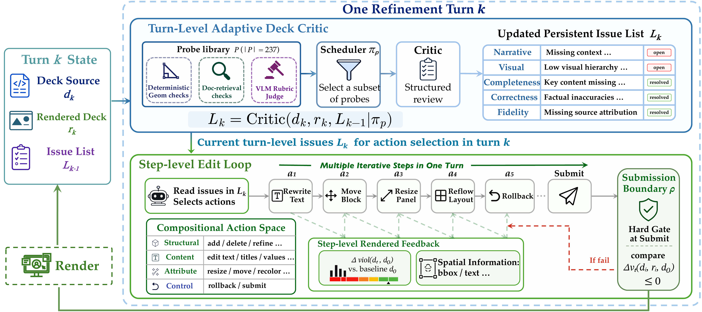

# ReDeck: Step-Level Render-Grounded Refinement for Document-to-Slide Generation

> **Re**fine + **Deck** = ReDeck

ReDeck is an agent system for **document-to-slide generation**. It refines generated decks with multi-granular feedback: step-level render-grounded observations for local spatial repair, a turn-level Adaptive Deck Critic for semantic and design direction, and a submission-level validation gate that prevents newly introduced layout violations from being committed.



## Overview

Presentation slides are dense visual artifacts. A good deck must preserve the source document's semantics, organize information into a coherent narrative, and place text, figures, charts, and visual emphasis within a bounded two-dimensional canvas. This makes document-to-slide generation a coupled semantic-spatial problem rather than a plain summarization task.

Most iterative slide agents follow a monolithic "one version, one feedback" loop: they rewrite a slide or deck, render it afterward, and receive feedback only at the turn boundary. That delayed feedback makes local failures such as overflow, overlap, clipping, low contrast, and off-canvas placement hard to attribute to the edit that caused them.

ReDeck changes the refinement loop to **"one edit, one observation"**. During a refinement turn, the agent edits the deck through atomic actions and receives renderer-derived observations after each step. This lets the agent fix local layout errors while their causes are still clear, while the turn-level critic continues to track global issues such as narrative flow, completeness, correctness, source fidelity, and visual design.

## Method

Each ReDeck refinement turn nests two feedback scales:

1. **Turn-level Adaptive Deck Critic** -- At the start of each turn, the critic evaluates the deck source and rendered slides, schedules a focused subset of checks, and updates a persistent issue list. The issue list records what remains unresolved across narrative, visual layout, completeness, correctness, and source fidelity.
2. **Step-level render feedback** -- Within the turn, every atomic edit is followed by rendering and structured observation. The observation reports the violation delta relative to the turn-start baseline and a layout anchor containing key element positions, dimensions, and text previews.
3. **Submission-level validation gate** -- Step-level feedback is an observation, not a verdict: temporary invalid states are allowed during repair. The hard gate appears only when the agent submits the turn, where newly introduced hard layout violations must be resolved before the deck state can advance.

This separation assigns feedback to the level where it is most reliable: deterministic renderer observations handle local spatial failures, the critic handles deck-wide semantic and design direction, and the submission gate prevents transient layout defects from becoming persistent progress.

## Pipeline

ReDeck takes documents such as scientific papers, technical reports, or business analyses as input and produces editable presentation decks through:

1. **Document Extraction** -- Parse the source document into structured text, figures, tables, formulas, and page screenshots.
2. **Evidence Indexing** -- Build a searchable evidence state over source chunks, figures, tables, and page-level context.
3. **Deck Planning** -- Generate a slide blueprint with slide intentions, layout specifications, and evidence links.
4. **HTML/CSS Code Generation** -- Generate each slide as HTML/CSS, render it to PNG via Playwright, and package the rendered slides into PPTX.
5. **Adaptive Deck Critic** -- Update the persistent issue list using specialized checks for correctness, completeness, source fidelity, visual quality, and narrative flow.
6. **Step-Level Repair Agent** -- Apply atomic edits, observe rendered consequences, rollback or retry when needed, and submit only after validation passes.

## Architecture

```
Document
    |
    v
[Document Processor] --> source_pack/ (text + figures + tables + screenshots)
    |
    v
[Source Indexer] --> EvidenceState (chunks + figures + tables + retrieval index)
    |
    v
[Deck Planner] --> DeckBlueprint (slide intents, layouts, evidence links)
    |
    v
[HTML CodeGen Compiler] --> HTML slide code --> Playwright PNG render --> PPTX packaging
    |
    v
[Turn-Level Adaptive Deck Critic] --> persistent issue list
    |       \
    |        [Narrative]       flow and coherence
    |        [Visual/Layout]   readability and spatial quality
    |        [Completeness]    coverage of required content
    |        [Correctness]     factual accuracy vs source
    |        [Source Fidelity] faithfulness and traceability
    |
    v
[Step-Level Repair Agent]
    |  atomic edit -> render -> observe -> rollback/retry/submit
    v
[Submission Gate] --> next turn or further repair
```

## Project Structure

```
app/
  orchestrator/          # Pipeline orchestration
    run_manager.py       # Main entry: multi-turn loop
    eval_router.py       # Dispatches evaluation across judges
    render_manager.py    # PPTX rendering via Playwright/LibreOffice
    turn_settler.py      # Convergence & turn budget logic
  modules/
    deck_planner.py      # Blueprint generation
    slide_layout_designer.py  # Layout constraint specification
    source_indexer.py    # Document content indexing (BM25)
    evaluators/          # critic checks, judges, and geometry probes
    redeck/              # Step-level repair loop
      agent_repair.py    # Core repair agent with tool use
      repair_worker.py   # Multi-slide repair orchestration
  backends/
    html_codegen/        # HTML/CSS slide generation, Playwright rendering, PPTX packaging
      html_codegen_compiler.py
  schemas/               # Pydantic data models
  prompts/               # System prompts for LLM calls
  llm_client.py          # OpenAI-compatible API wrapper
configs/                 # Run configurations
scripts/                 # Pipeline runner scripts
skills/                  # Standalone Claude Code skill prompt
demo/                    # Static project website and demo assets
assets/                  # README and paper figures
tests/                   # Unit tests
```

## Quick Start

### Prerequisites

- Python 3.11+
- OpenAI API access or an OpenAI-compatible API endpoint
- Playwright for HTML rendering
- LibreOffice for PPTX/PDF rendering checks

### Setup

```bash
pip install -e .
playwright install chromium
```

### Environment Variables

```bash
export OPENAI_API_KEY="your-api-key"
export OPENAI_MODEL="gpt-4o"

# Optional: set this for an OpenAI-compatible proxy or local server.
export OPENAI_BASE_URL="https://api.example.com/v1"
```

### Run

```bash
# Run a prepared document case
python3.11 scripts/run_pdf_pipeline.py \
    --case my_document \
    --html-codegen \
    --max-turns 3

# Repair an existing directory of HTML slides
python3.11 scripts/redeck_loop.py \
    --dir path/to/slides \
    --max-turns 3
```

### Input Format

Place source materials in `cases/<case_id>/source_pack/`:

```
source_pack/
  paper_full.md          # Source document text in Markdown
  figures/               # Extracted figures with JSON sidecar
    fig_p1_fig1.png
    fig_p1_fig1.json     # {caption, page, bbox, ...}
  tables/                # Extracted tables with JSON sidecar
    tbl_p5_tbl1.png
    tbl_p5_tbl1.json
  screenshots/           # Page screenshots (optional)
```

### Output

Each run produces per-turn artifacts in `runs/<run_id>/turn_XX/`:

- `deck_blueprint.json` -- Slide plan
- `slide_code/` -- Generated HTML per slide
- `slide_png/` -- Rendered slide images
- `eval/issues.jsonl` -- Persistent issue list updates
- `turn_summary.json` -- Turn-level convergence summary

## Research Design Decisions

- **Document-to-slide as semantic-spatial refinement**: ReDeck treats slide generation as jointly optimizing source fidelity, narrative structure, visual design, and layout validity rather than only summarizing a document into bullets.
- **Atomic edit actions instead of monolithic rewrites**: The repair agent works through compositional actions such as editing text, moving elements, resizing blocks, replacing images, reflowing layout, rollback, and submit. This makes the rendered consequence of each edit attributable.
- **Step-level render feedback**: After each edit, Playwright renders the slide and reports structured observations, including violation deltas and layout anchors. This collapses feedback delay from turn-level to edit-level for local spatial failures.
- **Feedback, not per-edit verdict**: Step-level observations guide the agent but do not reject every temporary violation. This keeps multi-step repairs reachable when a correct fix must pass through an intermediate invalid state.
- **Turn-level Adaptive Deck Critic**: Higher-level qualities are judged at the turn boundary, where narrative flow, completeness, factual correctness, source fidelity, and visual design are stable enough to evaluate.
- **Persistent issue list**: The critic, not the repair agent, owns issue creation and resolution. This prevents agent self-reporting and keeps unresolved deck-level goals visible across turns.
- **Submission-level validation gate**: The only hard layout gate is applied when the agent submits a turn. Newly introduced hard violations must be fixed before the turn can become the next baseline.

## Claude Code Skill

This repository also includes a standalone Claude Code skill in `skills/redeck.md`. The skill packages the core ReDeck prompt and an embedded Playwright-based `verify_layout` tool so Claude Code can generate or repair HTML slides with a lightweight edit-render-observe loop. It is intended for use cases where a user wants step-level render feedback without running the full multi-turn pipeline.

## Demo Website

The `demo/` directory is a static website with project pages, examples, and video assets. It can be hosted with GitHub Pages by publishing `demo/` as the Pages artifact through GitHub Actions.

## License

This project is licensed under the [MIT License](LICENSE).
