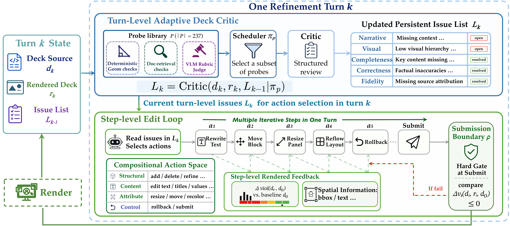

# ReDeck: Environment-Grounded Slide Generation and Refinement

*Turn slide refinement from “one draft, one verdict” into “one edit, one observation” — so the model can see what it changed before it moves on.*

[](https://aka.ms/ReDeck) [](https://arxiv.org/abs/2609.00194) [](https://www.python.org/) [](LICENSE)

## Overview

Today's slide agents can produce an impressive first draft, but they still revise it almost blind. A model may fix one overlap while creating another, or improve the layout at the cost of content fidelity. Templates avoid some of these failures, but only by limiting what the model can design.

**ReDeck treats the rendered deck as part of the agent's environment.** It renders each candidate, checks layout and source-grounded content, and gives the repair agent feedback before the next edit. Spatial and content probes can run in parallel, while one controller coordinates changes to each slide.

With this repo, you can:

- **Generate** a complete, source-grounded deck from a paper or document.
- **Repair** existing HTML slides with overflow, overlap, clipping, contrast, and other spatial issues.
- **Inspect and extend** every stage through saved slide code, renders, issue traces, and candidate-by-candidate artifacts.

ReDeck is designed for researchers, students, educators, designers, and developers who need to turn source documents into presentation decks or systematically improve decks they already have. In the paper experiments, ReDeck improves document-to-slide generation across GPT-5.4, Claude-4.6, and Gemini-3.1; on GPT-5.4, refinement raises spatial clean rate by **27.4 points**, content fidelity by **8.2 points**, and aesthetics by **0.69** over the initial draft. See the [paper](https://arxiv.org/abs/2609.00194) for the full evaluation and the [project page](https://aka.ms/ReDeck) for examples.

## 🎬 Demo Video

https://github.com/user-attachments/assets/c3f5d87e-d96e-4da0-b5de-f242e23bbc54

[Watch on the project website](https://aka.ms/ReDeck) · [Video page](demo/video.html) · [Video source](redeck-video/README.md)

---

## Quick Start

### Setup

Use Python 3.11 or newer, from the repository root:

```bash
python -m venv .venv
. .venv/bin/activate
python -m pip install -e .
python -m playwright install chromium
```

### Environment Variables

```bash
export OPENAI_BASE_URL="https://api.openai.com/v1"
export OPENAI_API_KEY="your-api-key"
```

For another OpenAI-compatible provider or a local server, set `OPENAI_BASE_URL` to its API URL and use its key. A local loopback server without authentication can use `OPENAI_API_KEY=dummy`. `.env.example` is a reference; variables must be exported in your shell.

Use `--model` for planning, generation and repair, and `--judge-model` for content review. Both default independently to `gpt-5.5`; set both to names supported by your provider. The endpoint must support text and image inputs. Requests send document text and slide images to the configured provider.

### Generate slides from a document

```bash
redeck generate --pdf /path/to/document.pdf --case my_document \
  --pages 8,12 --out runs/my-document --repair
```

`--pages 8,12` requests 8–12 output slides, not a PDF page range. Use `--pages 8` for an eight-slide budget. Digital PDF text and figures are extracted locally; scanned documents may need OCR or a prepared source pack.

To try the bundled example without making a model call:

```bash
redeck generate --case content_repair_smoke --cases-root examples/validation \
  --blueprint examples/validation/content_repair_smoke/blueprint.json \
  --out runs/synthetic-dry --dry-run
```

For generation and repair of the example, replace `--dry-run` with `--repair` and use a fresh output directory.

### Fix layout issues in existing slides

```bash
# Single slide, layout-only
redeck repair my_slide.html -o repaired/ \
  --probe-routes spatial --content-repair off

# Batch of slides, layout-only
redeck repair --dir path/to/slides/ -o repaired-batch/ \
  --probe-routes spatial --content-repair off --attempts 6

# Joint layout and content repair with the original source context
redeck repair --dir runs/my-document/slide_code --source-run runs/my-document \
  -o runs/my-document-repair --attempts 6
```

By default, spatial and content probes run in parallel. Use `--probe-execution serial` to run them sequentially. `--attempts` controls a shared budget of up to six candidates per slide. Content repair requires source context; layout-only repair preserves the slide's visible information.

### Theme selection

Choose a palette, luminance and design family:

```bash
redeck generate --case my_document --blueprint plan.json --out runs/my-style \
  --palette blue-corporate --lum dark --style-archetype technical-instrument \
  --information-density evidence-rich --asset-mode preserve --repair
```

The default palette is `gray-mono` with light luminance. Available palettes are listed in `pattern_library/metadata/theme_library.json`. `--design-family` selects non-color materials; `--asset-mode auto|preserve|table|chart` controls source-figure presentation. Reconstructed tables and charts require extracted data. See `redeck codegen --help` for all design options.

### Input format

Place source materials in `cases/<case_id>/source_pack/`:

```text
source_pack/
  paper_full.md          # Source document text in Markdown
  figures/               # Extracted figures with JSON sidecars
    fig_p1_fig1.png
    fig_p1_fig1.json
  tables/                # Extracted tables with JSON sidecars
    tbl_p5_tbl1.png
    tbl_p5_tbl1.json
```

Use `redeck generate --case <case_id> --out <output>` to plan and generate from this source pack. Supply `--blueprint plan.json` to reuse an explicit plan, or `--cases-root` to select another source directory.

### Output

Generation writes artifacts under the selected `--out` directory:

- `planning/deck_blueprint.json` — Slide plan, when new planning is requested
- `slide_programs/`, `deck_plan.json`, `theme.json` — Design decisions
- `slide_code/`, `slide_png/` — Generated HTML and rendered slide images
- `prompts/` — Generation prompts
- `run_manifest.json`, `judge_context.json` — Run metadata and source context
- `content_review/` — Content findings
- `repair/` — Original slides, candidates, diagnostics and final slides when `--repair` is used

Use fresh output directories for new runs. Review the generated HTML and images before presenting or sharing them.

---

## How it works

1. **Document Extraction** — Parse source text, figures and tables.
2. **Deck Planning** — Build a slide blueprint with propositions and evidence links.
3. **HTML/CSS Generation** — Select typed design materials, generate slides and render them in Playwright.
4. **Render-Grounded Review** — Check spatial geometry, visual quality and source-grounded content.
5. **Step-Level Repair** — Propose edits, render candidates, review the changes and accept or roll back them.

The key insight: **the repair agent sees rendered results after every candidate, not just at the end of a run.** This lets it catch and fix spatial issues while their causes are still clear.

<p align="center">
  
</p>

See [runtime architecture](docs/ARCHITECTURE.md) for the implementation details.

## Spatial Issue Detection

The detection engine renders slides in Playwright and combines DOM measurements with visual review:

| Category | What it catches |
| --- | --- |
| **Overlap** | Text and element collisions, accounting for intended nesting |
| **Text overflow** | Text exceeding containers, including table cells and SVG labels |
| **Clipping** | Content hidden by clipping boundaries |
| **Out-of-bounds** | Elements extending beyond the slide canvas |
| **Low contrast** | Text that is difficult to distinguish from its background |
| **Occlusion** | Opaque elements covering other content |
| **SVG internals** | Viewport clipping, label collisions and text-to-shape fit |

Run deterministic checks or source-grounded content review separately:

```bash
redeck spatial my_slide.html -o runs/spatial-check
redeck judge runs/my-document --output runs/content-review
```

Spatial reports distinguish repair blockers from style advisories. Visual and content review complement geometry checks; `ready_for_human_review` means the deck is ready for your final inspection.

## Project Structure

```text
redeck_style/             # Design planning, rendering contracts, evaluation and repair
app/
  modules/               # Source preparation, deck planning and probe runner
  schemas/               # Typed source, slide and issue models
  prompts/               # Planner and evaluation prompts
pattern_library/         # Design vocabulary, palettes and compatibility data
scripts/                 # CLI implementations and offline library builders
examples/                # Small runnable source-and-slide example
demo/                    # Project website, video and before/after gallery
redeck-video/            # Video source, narration and recorded trajectory frames
assets/                  # Project diagrams
docs/                    # Architecture and command compatibility
skills/                  # Agent usage instructions
tests/                   # Runtime and website regression tests
```

For development, install `python -m pip install -e '.[dev]'`, then run `python -m pytest tests/current tests/showcase` and `python -m build`. Offline design-library builders require the original seed materials. See [command compatibility and build instructions](docs/MIGRATION.md).

## Demo Website

Visit the [project page](https://aka.ms/ReDeck) for the demo video and examples. The `demo/` directory contains the website, [repair gallery](demo/index.html#repairs) and [video page](demo/video.html); the bundled GitHub Pages workflow publishes it. The [video project](redeck-video/README.md) includes the Remotion source and build instructions.

## License

This project is licensed under the [MIT License](LICENSE). See [SECURITY.md](SECURITY.md) for guidance on handling source documents and untrusted HTML.
